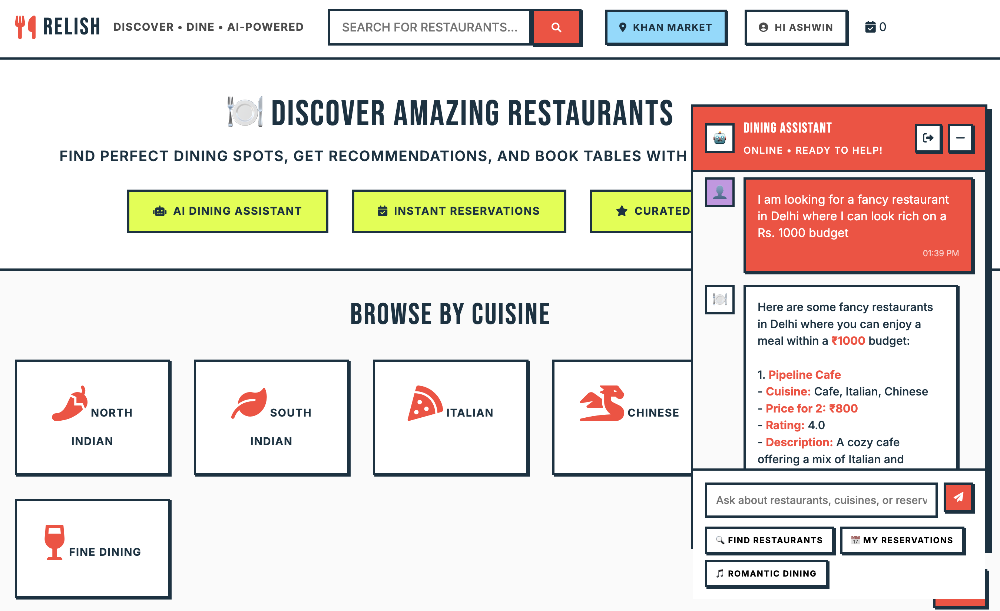
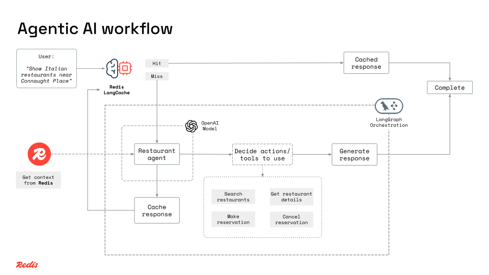

# 🍽️ Restaurant Discovery AI Agent

**Redis-powered restaurant discovery with intelligent dining assistance.**

An AI-powered restaurant discovery platform that combines Redis's speed with LangGraph's intelligent workflow orchestration. Get personalized restaurant recommendations, smart dining suggestions, and lightning-fast responses through semantic caching.

## App screenshots



---

## Tech Stack

- **Node.js** + **Express** (Backend API)
- **Redis** (Restaurant store, agentic AI memory, conversational history, and semantic caching with Redis LangCache)
- **OpenAI API** (GPT-4 for intelligent responses and embeddings for vector search)
- **LangGraph** (AI workflow orchestration)
- **HTML + CSS + Vanilla JS** (Frontend)

---

## Product Features

- **Smart Restaurant Discovery**: AI-powered assistant helps you find restaurants, discover cuisines, and manage your reservations. Both text and vector-based search across restaurants
- **Dining Intelligence**: Get restaurant recommendations with detailed information for any cuisine or occasion using RAG (Retrieval Augmented Generation)
- **Demo Reservation System**: Reservation management - add, view, and manage restaurant reservations *(Simplified demo implementation, not a production-ready reservation system)*

### Technical features

- **Redis as memory layer**: For fast data retrieval
- **Vector Search**: Find restaurants using AI-powered similarity search
- **Semantic Cache**: Similar queries return instantly using Redis LangCache
- **LangGraph Workflows**: AI agent routing, tool selection
- **Multi-tool Agent**: Restaurant tools, search tools, reservation tools, and knowledge tools

---

## Setup

Follow the setup instructions below to get started.

### Prerequisites

- **Redis**: Use [Redis Cloud](https://redis.io) (no installation required)
- **Redis LangCache API**: [Get LangCache credentials](https://redis.io/langcache)
- **OpenAI API Key**: [Create an API key](https://platform.openai.com/account/api-keys)
- **Node.js (v18 or higher)**: [Download & Install Node.js](https://nodejs.org/)

### Installation

1. **Clone and setup**

   ```bash
   git clone <repository-url>
   cd relish
   npm install
   ```

2. **Configure environment**

   ```bash
   cp .env.example .env
   # Edit .env with your Redis URL, OpenAI key, and LangCache credentials
   ```

3. **Load restaurant data**

   ```bash
   npm run load-restaurants
   ```

4. **Start the server**

   ```bash
   npm start
   ```

5. **Open your browser**

   ```
   http://localhost:3000
   ```

---

## Architecture

### Technical architecture





### Project architecture

```
│
├── package.json
├── index.js
├── config.js
├── services/
│   ├── restaurants/          # Restaurant Business Component
│   │   ├── api/                 # REST API endpoints
│   │   ├── domain/              # Business logic
│   │   └── data/                # Data access layer
│   ├── reservations/         # Reservation Business Component
│   │   ├── api/
│   │   ├── domain/
│   │   └── data/
│   ├── chat/                 # Chat/Cache Business Component
│   │   ├── api/
│   │   ├── domain/
│   │   └── data/
│   ├── users/                # User Business Component
│   │   ├── domain/
│   │   └── data/
│   ├── ai/                   # Agentic AI Layer
│   └── routes/
├── client/                   # Frontend assets
├── views/                    # HTML and Handlebars templates
├── scripts/                  # Data loading scripts
└── README.md                 # This file
```
---

## API Endpoints

- `POST /api/chat` - Main chat interface for AI restaurant assistant
- `GET /api/restaurants/search` - Search restaurants with text/vector similarity
- `POST /api/reservations/add` - Add restaurant reservations *(demo implementation)*
- `GET /api/reservations` - View reservation history *(demo implementation)*
- `DELETE /api/reservations` - Cancel reservations *(demo implementation)*

---

## Contributing

1. Fork the repository
2. Create your feature branch (`git checkout -b feature/amazing-feature`)
3. Commit your changes following [Conventional Commits](https://www.conventionalcommits.org/) (`git commit -m 'feat: add amazing feature'`)
4. Push to the branch (`git push origin feature/amazing-feature`)
5. Open a Pull Request

---

## Maintainers

- **Ashwin Hariharan** - [@booleanhunter](https://github.com/booleanhunter)

---

## License

This project is licensed under the MIT License - see the [LICENSE](/LICENSE) file for details.

---

## 🐞 Reporting Issues

If you find a bug or have a feature request, please open an issue in the repository.

---
