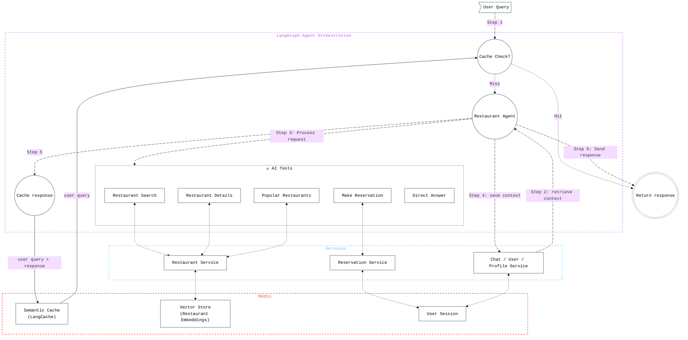

# Relish Restaurant Discovery Architecture

```mermaid
%%{init: {'theme':'base', 'themeVariables': {'fontFamily': 'Space Mono, monospace'}}}%%
flowchart TD
    %% User Layer
    User>"User Query"]
    
    %% LangGraph Agent Layer
    subgraph LangGraph["LangGraph Agent Orchestration"]
        CacheCheck(("Cache Check?"))
        RestaurantAgent(("Restaurant Agent"))
        SaveCache(("Cache response"))

        %% Tools Layer
        subgraph AITools["🔧 AI Tools"]
            SearchTool["Restaurant Search"]
            DetailsTool["Restaurant Details"]
            ReservationTool["Make Reservation"]
            PopularTool["Popular Restaurants"]
            AnswerTool["Direct Answer"]
        end
    end
    
    %% Cache Layer
    subgraph RedisCache["Redis"]
        SemanticCache["Semantic Cache<br/>(LangCache)"]
        VectorStore["Vector Store<br/>(Restaurant Embeddings)"]
        UserSession["User Session"]
    end
    
    %% Services Layer
    subgraph ServicesLayer["Services"]
        ReservationService["Reservation Service"]
        RestaurantService["Restaurant Service"]
        ChatService["Chat / User / Profile Service"]
    end
    
    %% Flow connections with step numbers
    User e1@--> |Step 1| CacheCheck
    e1@{ animate: true }

    SemanticCache --> |user query| CacheCheck
    CacheCheck -.->|Hit| End((("Return response")))
    CacheCheck -.->|Miss| RestaurantAgent

    ChatService e2@--> |Step 2: retrieve context| RestaurantAgent
    e2@{ animate: true }

    RestaurantAgent e3@-.-> |Step 3: Process request| AITools
    e3@{ animate: true }

    RestaurantAgent e4@--> |Step 4: save context| ChatService
    e4@{ animate: true }

    RestaurantAgent e5@--> |Step 5| SaveCache
    e5@{ animate: true }
    SaveCache --> |user query + response| SemanticCache

    RestaurantAgent e6@--> |Step 6: Send response| End
    e6@{ animate: true }
    
    %% Internal connections
    SearchTool <-.-> RestaurantService
    DetailsTool <-.-> RestaurantService
    PopularTool <-.-> RestaurantService
    ReservationTool <-.-> ReservationService

    RestaurantService <-.-> VectorStore
    ReservationService <-.-> UserSession
    ChatService <-.-> UserSession
    
    classDef stepStyle fill:#eeeeee,color:#000000,stroke:#000000,stroke-width:2px,font-weight:bold
    classDef nodeStyle fill:transparent,color:#000000,stroke:#8a99a0,stroke-width:2px
    classDef subgraphStyle fill:transparent,color:#000000,stroke:#8a99a0,stroke-width:1px
    
    classDef purple fill:transparent,color:#c795e3,stroke:#c795e3,stroke-width:2px, font-weight: bold, stroke-dasharray: 5 5
    classDef red fill:transparent,color:#ff4438,stroke:#ff4438,stroke-width:2px, stroke-dasharray: 5 5
    classDef blue fill:transparent,color:#80dbff,stroke:#80dbff,stroke-width:2px, font-weight: bold, stroke-dasharray: 5 5

    class User,CacheCheck,RestaurantAgent,SaveCache,SemanticCache,VectorStore,UserSession,SearchTool,DetailsTool,ReservationTool,PopularTool,AnswerTool,ReservationService,RestaurantService,ChatService, nodeStyle
    class End,LangGraph,RedisCache,AITools subgraphStyle
    class LangGraph purple
    class RedisCache red
    class ServicesLayer blue
```

